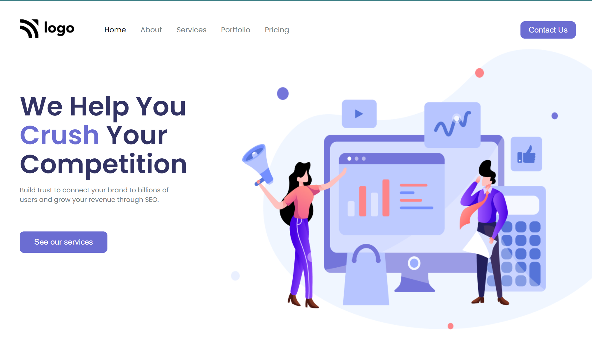

# SEO Landing Page

> ## [Prateek Budhiraja](https://prateekbudhiraja.in)

 

## Tech Stack:

---

### Checkout the live website [here](https://seo-landing.vercel.app/).

---

## My Learnings

- Learned how to position elements one on right and one on left.
- Learned about flex properties.

---

## How the website looks like

